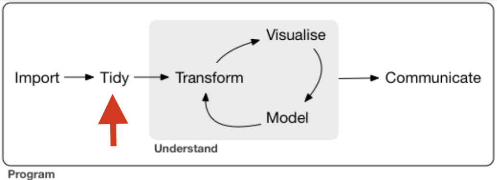

# Presentation structure

<br>
### Tidy tools for time-series data

.pull-left[

1. Time-Series Data Recap

2. Introduction to the Tsibble Package

3. Introduction to the Fable Package

4. Introduction to the Feasts Package

5. Q&A and Practice

6. Additional resources 
]


.pull-right[
<div align="center">
<br>

</div>
]


---

class: inverse, center, middle
name: section

# Time-series data

<html><div style='float:left'></div><hr color='#EB811B' size=1px style="width:1000px; margin:auto;"/></html>

---

# What are time-series data? A little statistics recap!

#### "A time series is defined as a time-ordered sequence of observations taken at regular intervals (e.g., hourly, daily, weekly, monthly, quarterly, annually)." (Vijay Kotu and Deshpande, 2019)


#### Main concepts include: 
- *Trends:* refer to the long-term movement or direction in the data, showing an overall upward or downward progression over time.
- *Seasonality:* refers to repeating patterns or fluctuations that occur at regular intervals over time. These patterns are often driven by external, cyclical factors, such as seasons, months, or days of the week, and they tend to recur at the same point in each cycle.
- *Cyclic patterns:* refer to fluctuations that occur over longer periods of time but do not follow a fixed, regular interval like seasonality. These patterns rise and fall due to long-term influences, such as economic cycles, and can vary in both duration and amplitude.

#### Applications and example
Forecasting and trend analysis are some of the most widespread applications of time-series data.
GIVE SOME EXAMPLES: e.g., monitoring or predicting unemployment rates.


---

# Working with time-series data can be challenging

##### Missing data / Outliers

Missing data or outliers can distort time-series analysis by introducing gaps or extreme values that don't fit the general pattern. 

##### Non-Stationarity

Non-stationarity means that the statistical properties of a time series, like its mean or variance, change over time, making it difficult to predict.

##### Handling multiple time-series

When working with multiple time series it becomes challenging to manage and analyze them simultaneously. Organizing and structuring them properly is key to identifying trends and patterns efficiently across all series.

##### Availability of tidy data

Time-series data is often messy and not ready for analysis, making it harder to apply standard tools (e.g., data format issues).


---

class: inverse, center, middle
name: section

# Tidy tools for time-series: (1) Tsibble package

<html><div style='float:left'></div><hr color='#EB811B' size=1px style="width:1000px; margin:auto;"/></html>

---

# General information on the Tsibble package


.pull-left[
<br>
#### "The tsibble package provides a data infrastructure for tidy temporal data with wrangling tools. Adapting the tidy data principles, tsibble is a data- and model-oriented object." 
<br>

Developed by Earo Wang, Di Cook, Rob Hyndman and Mitchell O'Hara-Wild.
<br>
<br>
Install and load as usual:  
`install.packages("tsibble")`
<br> 
`library(tsibble)`
]
<div align="right">
<br>

</div>
<div align="right">
<br>

</div>
---


# Why work with tsibble?

- *Part of Tidyverse*, tsibble aligns with the "tidy" principles of the tidyverse (i.e., every column is a variable, every row is an observation, and every dataset is one table). Allowys eamless integration with tidyverse  packages like dplyr, ggplot2, or tidyr.

- Provides a set of tools and functions which make it *easier to prepare time-series data for analysis, visualization and forecasting* (e.g., missing data handling, duplicates check, etc.).

- Facilitates dealing with *multiple and large volumes of time-series data* (using the key and index structure).

---


# The three pillars of tsibble (Wang, Cook and Hyndman, 2019)

1. Index: Index is a variable representing time ordered from past to present.
2. Key:  single or multiple variables that identify units over time.
3. Interval: There are three possible interval types: fixed, unknown, and irregular. Event data
typically involves irregular time intervals (e.g., flight schedules) which can flow into event-based data modeling, but would need to be processed, or regularized, to fit models that expect data with a fixed-time interval.

##### From these pillars, the four tsibble rules can be derived.

---


# The four tsibble rules (Wang, Cook and Hyndman, 2019)

##### The “tidy data” principles are adapted in tsibble with the following rules:
1. Index is a variable with inherent ordering from past to present. 
2. Key is a set of variables that define observational units over time.
3. Each observation should be uniquely identified by index and key.
4. Each observational unit should be measured at a common interval, if regularly spaced.

---


# Tsibble's main verbs

`as_tsibble()` :  Converts data into a "tsibble". "Tsibbles" are the starting point for using the tsibble package. It allows you to specify the index and key.
`my_tsibble <- as_tsibble(data, index = date, key = id)`

`has_gaps()` and `count_gaps()` : Check and counts missing time points.
`my_tsibble %>% count_gaps()`

`fill_gaps()` : Missing values are filled in with NAs.

`index_by()` : Group data by time the index. Similar to dplyr:group_by(). Can be collapsed with summarise().

`group_by_key()` : Groups data by the key. Similar to dplyr:group_by(). Can be collapsed with summarise().

`interval()` : Extracts and verifies the time interval between observations.

`index()` : Extracts the index (time variable) from a tsibble.

---
class: inverse, center, middle
name: section

# Tidy tools for time-series: (2) Fable package

<html><div style='float:left'></div><hr color='#EB811B' size=1px style="width:1000px; margin:auto;"/></html>

---


# Slide Title

### More Text Content

- Bullet Point 1
- Bullet Point 2
- Bullet Point 3

---


# Slide Title

### More Text Content

- Bullet Point 1
- Bullet Point 2
- Bullet Point 3

---


# Slide Title

### More Text Content

- Bullet Point 1
- Bullet Point 2
- Bullet Point 3

---

class: inverse, center, middle
name: section

# Tidy tools for time-series: (3) Feasts package

<html><div style='float:left'></div><hr color='#EB811B' size=1px style="width:1000px; margin:auto;"/></html>

---


# Slide Title

### More Text Content

- Bullet Point 1
- Bullet Point 2
- Bullet Point 3

---

# Slide Title

### More Text Content

- Bullet Point 1
- Bullet Point 2
- Bullet Point 3

---

# Slide Title

### More Text Content

- Bullet Point 1
- Bullet Point 2
- Bullet Point 3

---


# Slide Title

### More Text Content

- Bullet Point 1
- Bullet Point 2
- Bullet Point 3

---

class: inverse, center, middle
name: section

# Q&A and Practice

<html><div style='float:left'></div><hr color='#EB811B' size=1px style="width:1000px; margin:auto;"/></html>

---


# Code Example

```{r, eval = FALSE}
# Code goes here
# 
```


---

# Next slide


---

# Next slide


---

# References

Vijay Kotu and Deshpande, B. (2019). Introduction. Elsevier eBooks, [online] pp.1–18. doi:https://doi.org/10.1016/b978-0-12-814761-0.00001-0.

Wang, E., Cook, D. and Hyndman, R. (2019). A new tidy data structure to support exploration and modeling of temporal data A new tidy data structure to support exploration and modeling of temporal data. [online] Available at: https://pdf.earo.me/tsibble.pdf [Accessed 22 Oct. 2024].


---


# Additional resources 

##### On Tsibbles:
[Research paper: A new tidy data structure to
support exploration and modeling
of temporal data](https://pdf.earo.me/tsibble.pdf)

[Tsibble Main Page](https://tsibble.tidyverts.org/)

[Tsibble RDocumentation](https://search.r-project.org/CRAN/refmans/tsibble/html/tsibble-package.html)

##### On XXX:

##### On YYY:


---

